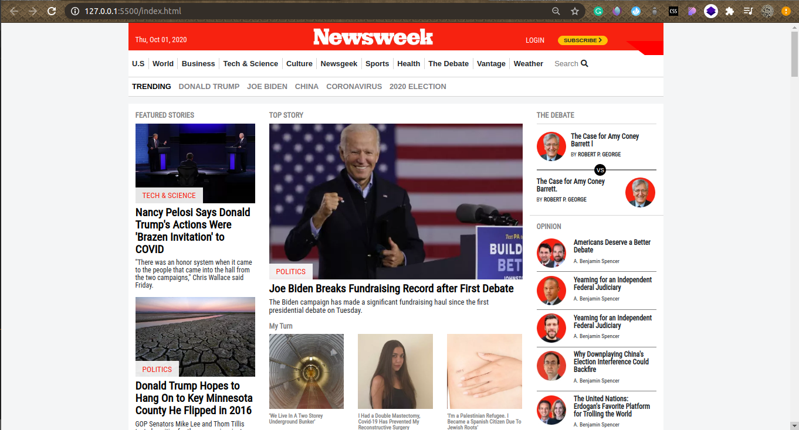

# THE NEWSWEEK

This project is a clone of the Newsweek website at (newsweek.com). As a requirement of the program, basic HTML and CSS were used during the design. 

## Built With

- HTML
- CSS
- Bootstrap

## Live Demo

[Live Demo Link](https://rawcdn.githack.com/Janluc/Newsweek-Clone/c4b163057de9078d073bf374e205c51499ac0fd6/index.html)

## Getting Started

To get a local copy up and running follow these simple example steps.

### Prerequisites

- A operating system such as Windows, MAC, or Linux
- A modern browser such as Google Chrome, Mozilla Firefox, or Microsoft Edge

### Setup
- Clone or download the repo and run the HTML File.

## Authors

👤 **Author1**

- GitHub: [@Janluc](https://github.com/Janluc)
- Twitter: [@Janluc123](https://twitter.com/Janluc123)
- LinkedIn: [LinkedIn](https://www.linkedin.com/in/janluc-saneaux-91707a1b4/)

👤 **Author2**

- GitHub: [@mke2111](https://github.com/mke2111)
- Twitter: [@Roymkenya](https://twitter.com/Roymkenya)
- LinkedIn: [Roy Mukuye](https://www.linkedin.com/in/roy-mukuye-42b07b1b4)

## 🤝 Contributing

Contributions, issues, and feature requests are welcome!

Feel free to check the [issues page](https://github.com/Janluc/Newsweek-Clone/issues).

## Show your support

Give a ⭐️ if you like this project!

## 📝 License

N/A# TNW-Clone